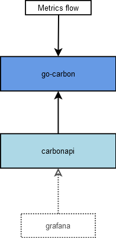
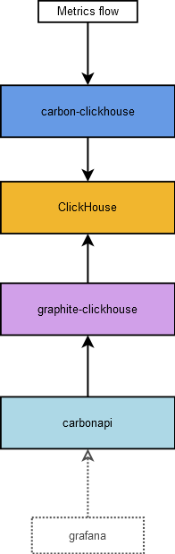

# Documentation
Documentation for go-graphite project

# List compatible components of the stack
## Storage layer
### Whisper TSDB
- [go-carbon](https://github.com/lomik/go-carbon)

### Clickhouse as TSDB
- [carbon-clickhouse](https://github.com/lomik/carbon-clickhouse)
- [graphite-clickhouse](https://github.com/lomik/graphite-clickhouse)

### In-memory TSDB
- [carbonmem](https://github.com/go-graphite/carbonmem)

## Presentation layer
- [carbonzipper](https://github.com/go-graphite/carbonzipper)
- [carbonapi](https://github.com/go-graphite/carbonapi)

# Work schemes with minimal set of components
## With whisper as storage backed

## With ClickHouse as storage backend
